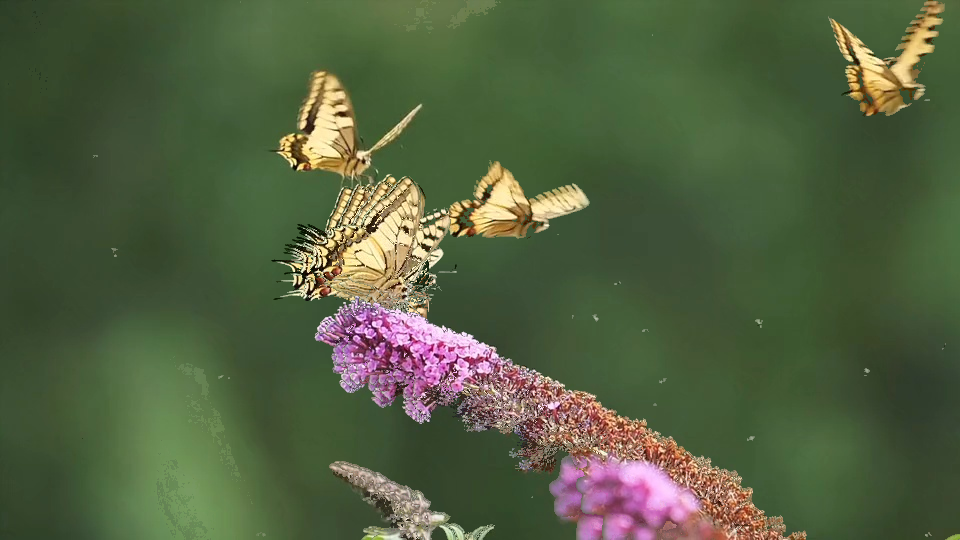

# ZIT (Zooplankton Image Tool)

Makes plankton photos look real good. 

Useful for compositing plankton motion.

Skip kwarg allows for selection of specific frames window

Interval chops up the video found in samples to a specific second cadence

noise_delta is based on the average pixel of the overlay. If the overlayed pixel is itself noise, do not overlay it.

composite_epsilon is the difference between overlay and background threshold required to perform the overlay in composition


CLI:
```
python3 zit.py
```

