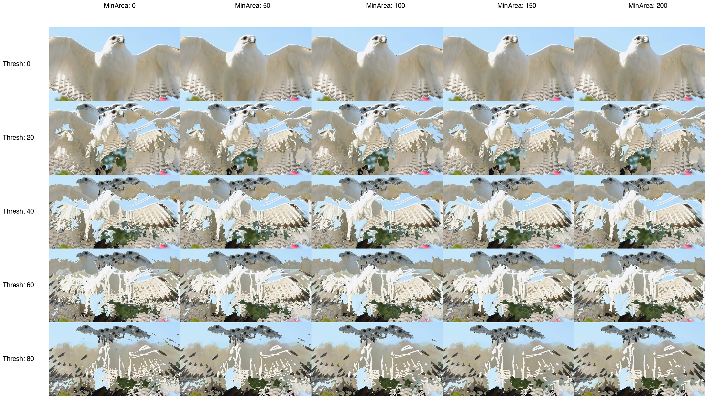
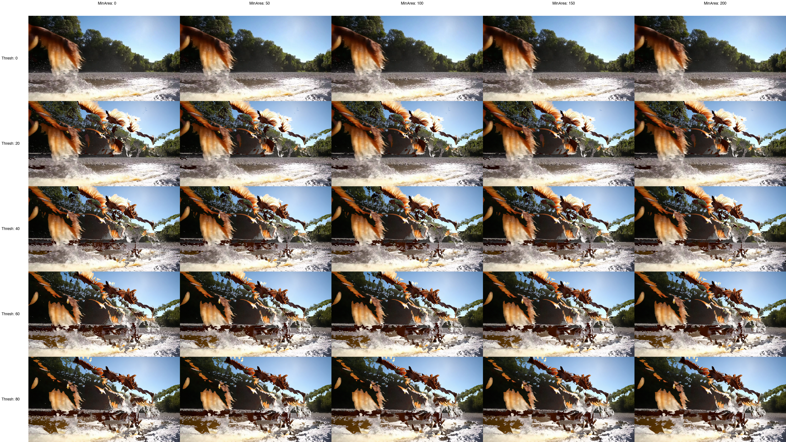
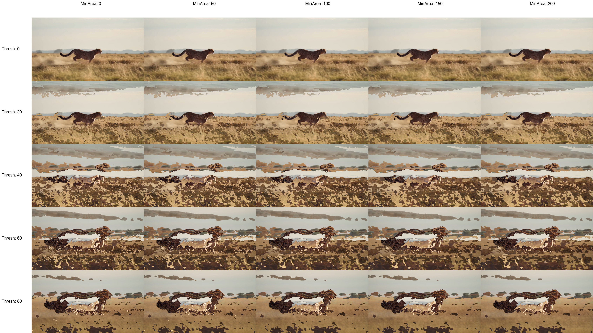
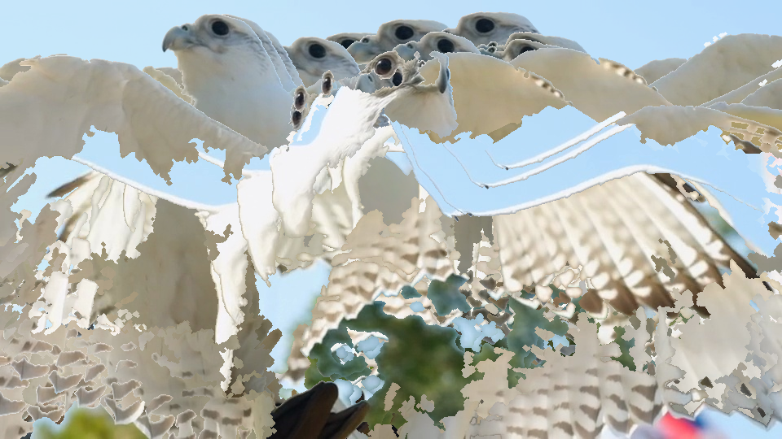
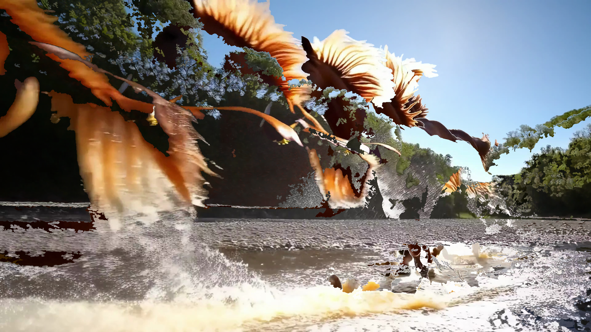
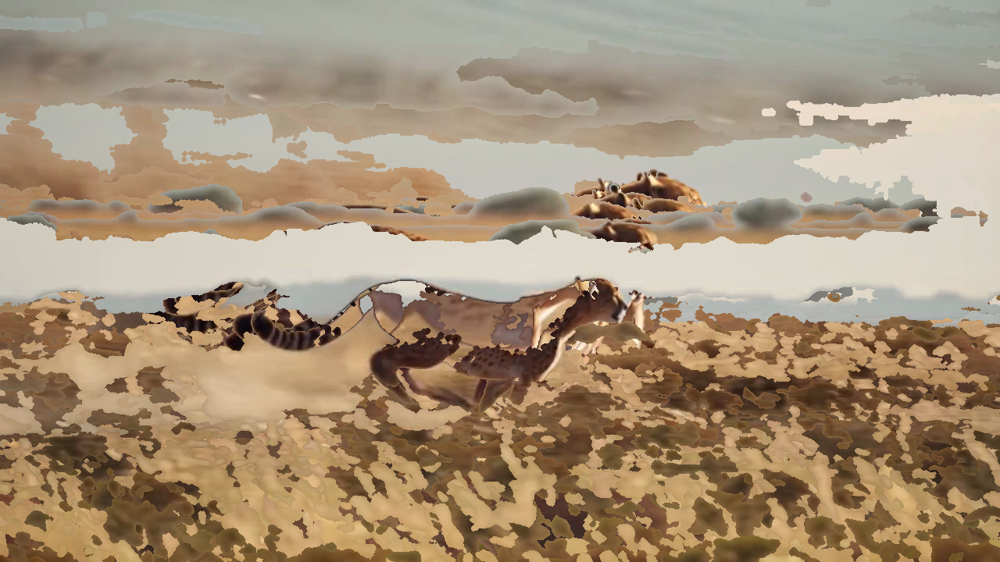

# ZIT (Zooplankton Image Tool)

ZIT is a tool designed to enhance and composite plankton photos from video frames. It uses computer vision techniques (OpenCV MOG2 background subtraction and contour filtering) to create clean, high-quality composites showing the locomotion of zooplankton.


## Features
- **Frame Capture:** Extract frames from videos at specified intervals.
- **Motion-Based Composition:** Create composites by overlaying moving entities on a stable background.
- **Entity Recognition:** Uses MOG2 background subtraction to isolate animals from noise and artifacts.
- **Parameter Sweeping:** Find optimal threshold values for different video conditions.

## Installation
Ensure you have [Poetry](https://python-poetry.org/) installed.

```bash
poetry install
```

## Usage

### CLI
Capture frames and create a composite in one command:

```bash
# Using poetry
poetry run zit --input samples/limo.mp4 --composite --entities

# If installed
zit --input samples/limo.mp4 --composite --entities
```

### Parameters
- `--input`, `-i`: Path to the input video.
- `--interval`: Interval in seconds for frame capture (default: `1`).
- `--composite`: Enable composition after frame capture.
- `--entities`: Use entity recognition for cleaner composites (recommended).
- `--epsilon`: Difference threshold for entity detection (default: `20.0`). Also referred to as `Thresh` in sweep grids.
- `--noise`: Minimum pixel area for a detected entity (default: `50.0`). Also referred to as `MinArea` in sweep grids.
- `--skip START END`: Process only a specific frame range.
- `--out-file`: Name of the output composite image (default: `composited.png`).

### Parameter Sweep
To find the optimal threshold values for your video, use the parameter sweep script. It generates a 5x5 grid of composites sweeping across `MinArea` (noise) and `Thresh` (epsilon).

```bash
python sweep_grid.py
```

## Gallery

### Parameter Grids
Find the optimal thresholds for different conditions. These grids show variations in `MinArea` and `Thresh`.

| Video 184368 Sweep | Video 230717 Sweep | Video 307555 Sweep |
| :---: | :---: | :---: |
|  |  |  |

### Entity Recognition Results
Clean composites generated using OpenCV MOG2 and contour filtering.

| Video 184368 | Video 230717 | Video 307555 |
| :---: | :---: | :---: |
|  |  |  |

### Examples


## Cleanup
To remove temporary files and generated frames:

```bash
rm -rf temp_sweep_* frames/
```
