# ZIT (Zooplankton Image Tool)

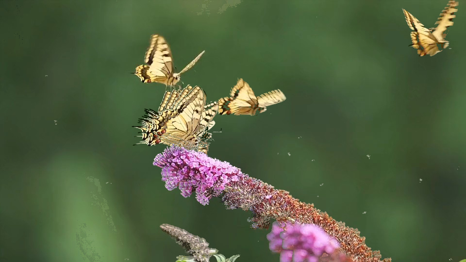

Makes plankton photos look real good. 


CLI: 
```bash
# Using poetry
poetry run zit --input samples/limo.mp4 --composite

# If installed
zit --input samples/limo.mp4 --composite
```

## Installation

```bash
poetry install
```

## Plankton Grid

### 184368 Comparison
| Eps 5 | Eps 10 | Eps 15 | Eps 25 | Eps 50 |
| :---: | :---: | :---: | :---: | :---: |
| 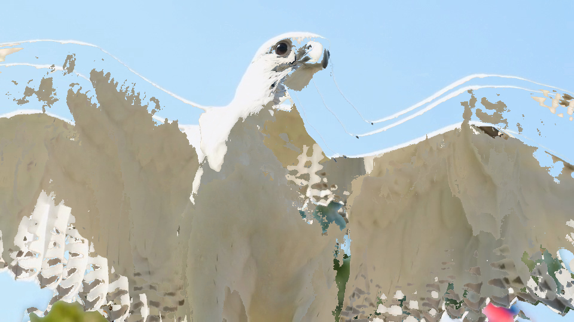 | 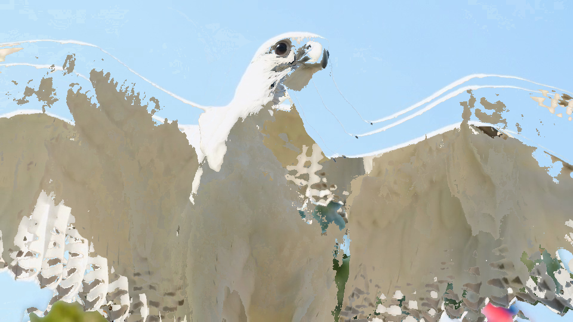 | 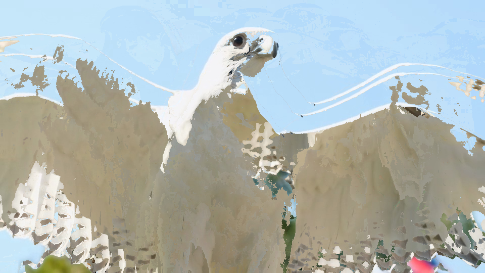 |  | 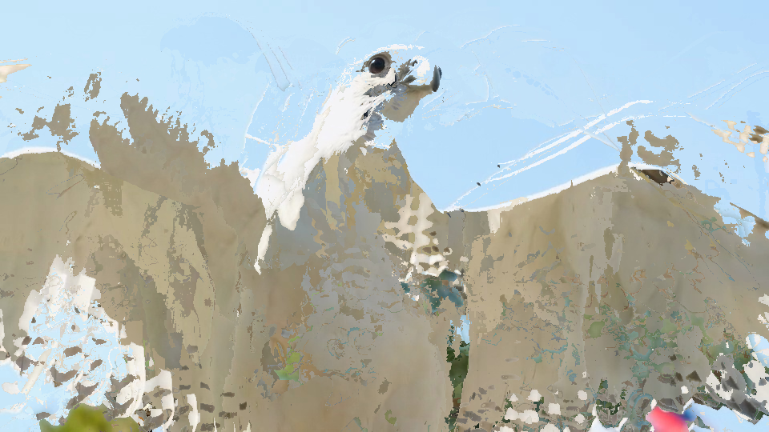 |

### 230717 Comparison
| Eps 5 | Eps 10 | Eps 15 | Eps 25 | Eps 50 |
| :---: | :---: | :---: | :---: | :---: |
| 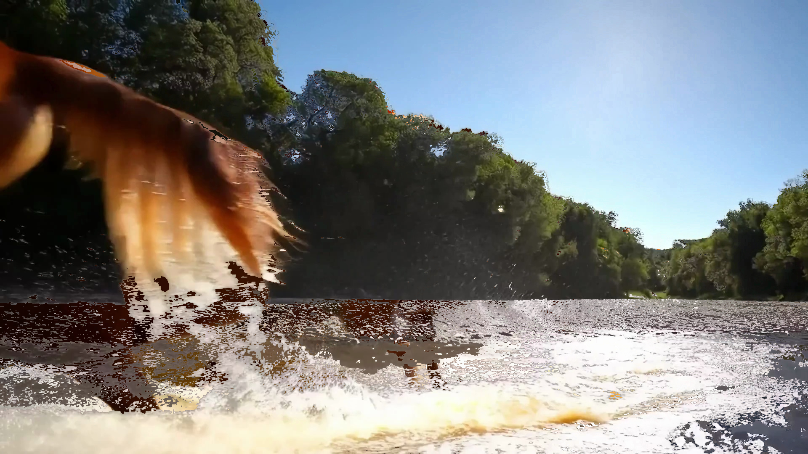 |  |  | 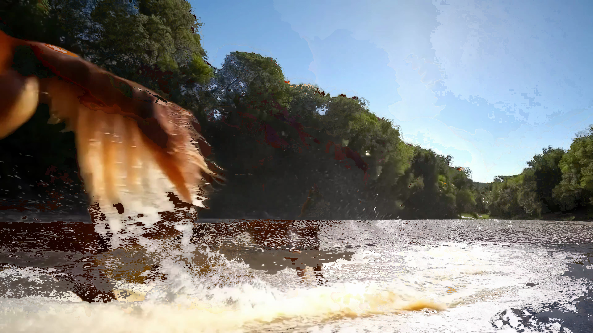 | 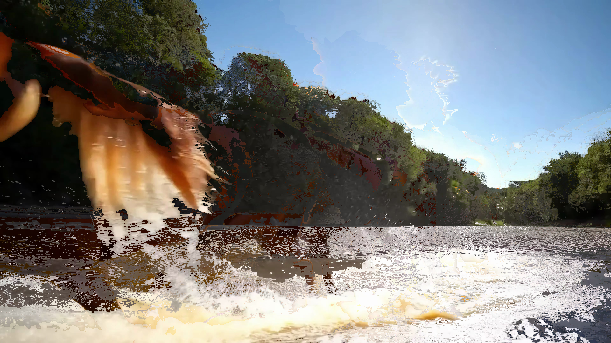 |

### 307555 Comparison
| Eps 5 | Eps 10 | Eps 15 | Eps 25 | Eps 50 |
| :---: | :---: | :---: | :---: | :---: |
|  | 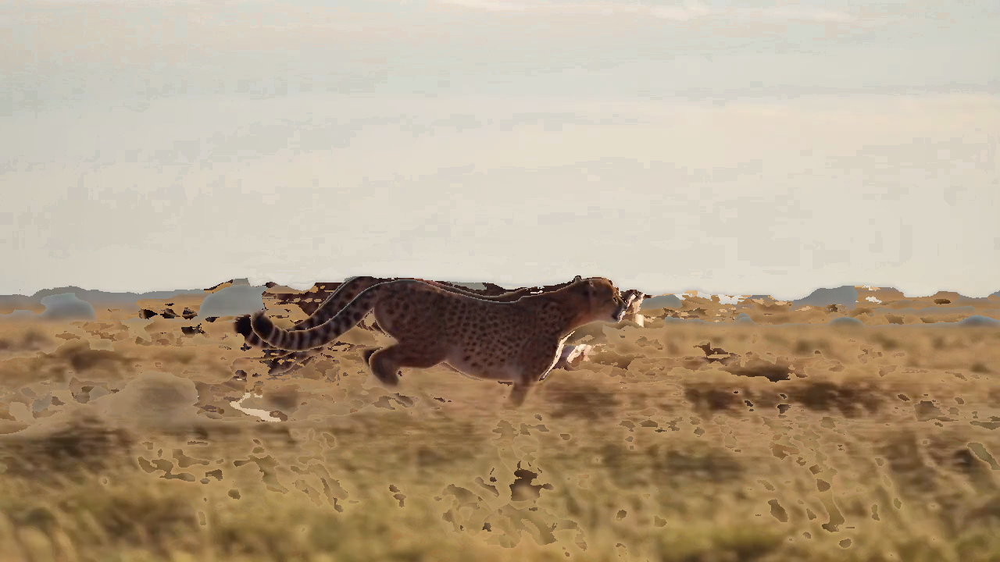 | 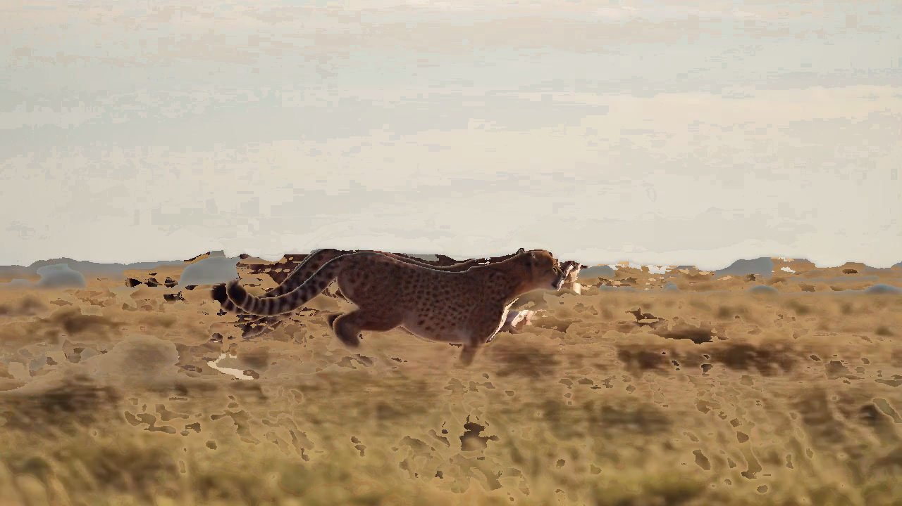 | 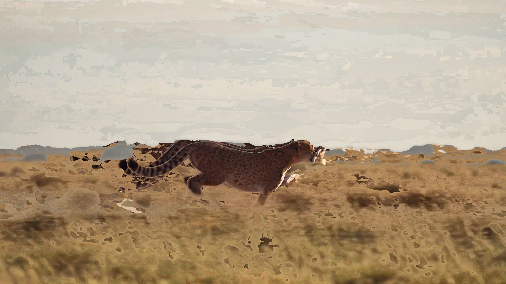 | 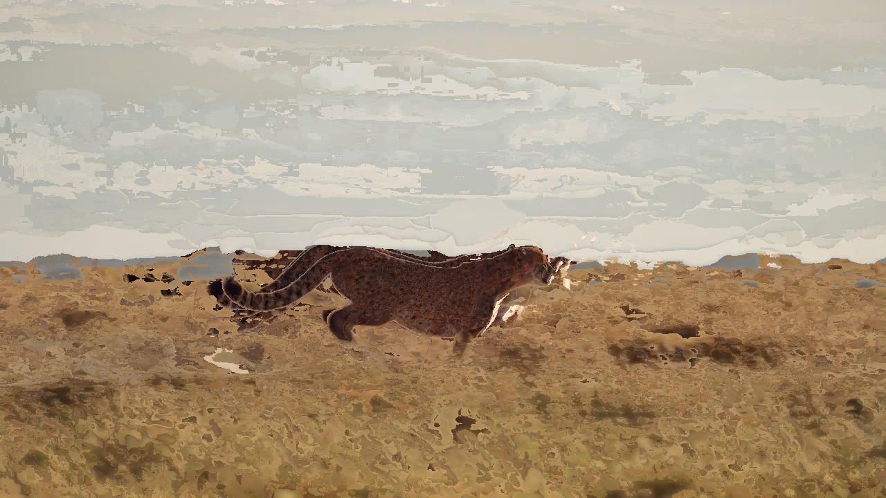 |


# Documentation

You will find the `composite_from_frames` method useful for creating composites of plankton locomotion.

***skip*** allows for selection of specific frames window

***interval*** deteermines the cadence of video screen captures, in seconds

***noise_delta*** is based on the average pixel of the overlay. If the overlayed pixel is itself noise, do not overlay it

***composite_epsilon*** is the difference between overlay and background threshold required to perform the overlay in composition
