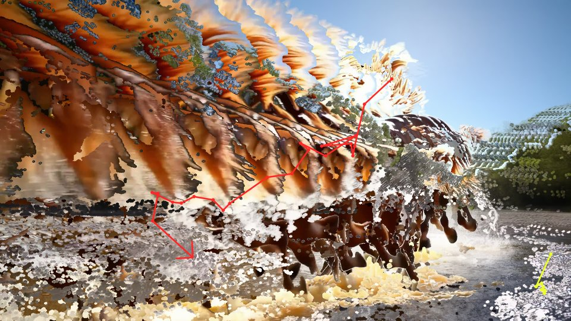

# ZIT (Zooplankton Image Tool)

ZIT is a tool designed to enhance and composite plankton photos from video frames. It uses computer vision techniques (OpenCV MOG2 background subtraction and contour filtering) to create clean, high-quality composites showing the locomotion of zooplankton.


## Features
- **Frame Capture:** Extract frames from videos at specified intervals.
- **Motion-Based Composition:** Create composites by overlaying moving entities on a stable background.
- **Entity Recognition:** Uses MOG2 background subtraction to isolate animals from noise and artifacts.
- **Parameter Sweeping:** Find optimal threshold values for different video conditions.
- **Trajectory Tracking:** Link detected animals across frames, draw their paths onto the composite, and export positions to CSV.

## Installation
Ensure you have [Poetry](https://python-poetry.org/) installed.

```bash
poetry install
```

## Usage

### CLI
Capture frames and create a composite in one command:

```bash
# Using poetry
poetry run zit --input videos/230717_small.mp4 --composite --entities

# If installed
zit --input videos/230717_small.mp4 --composite --entities
```

### Parameters
- `--input`, `-i`: Path to the input video.
- `--interval`: Interval in seconds for frame capture (default: `1`). Fractions are allowed, e.g. `0.25`.
- `--composite`: Enable composition after frame capture.
- `--entities`: Use entity recognition for cleaner composites (recommended).
- `--epsilon`: Difference threshold for entity detection (default: `20.0`). Also referred to as `Thresh` in sweep grids.
- `--noise`: Minimum pixel area for a detected entity (default: `50.0`). Also referred to as `MinArea` in sweep grids.
- `--skip START END`: Process only a specific frame range.
- `--out-file`: Name of the output composite image (default: `composited.png`).

### Tracking
With `--entities`, detected animals can be linked into trajectories:

```bash
zit -i videos/230717_small.mp4 --interval 0.25 --composite --entities \
    --trails --tracks-csv tracks.csv --track-merge 0.12 --max-jump 250 --min-straightness 0.5
```

- `--trails`: Draw each tracked animal's path (one color per track, arrow at the end) onto the composite.
- `--tracks-csv`: Write `track_id, frame, x, y, area` for every sighting.
- `--max-jump`: Max pixels an animal may move between sampled frames and keep its track (default: `50`).
- `--min-track-points`: Min sightings for a track to be kept (default: `4`).
- `--min-straightness`: Min net displacement / path length, 0–1 (default: `0.7`). Filters out flickering noise that links into zig-zags.
- `--track-merge`: Fuse fragments within this fraction of the frame size before tracking (default: `0`, off). Large animals break into many pieces under MOG2; `0.05`–`0.12` rejoins them into one blob. Leave off for small organisms like plankton.

Tracking needs a fixed camera. In a panning shot the animal stays in the middle of the frame, so there's no path to draw.

### Parameter Sweep
To find the optimal threshold values for your video, use the parameter sweep script. It generates a 5x5 grid of composites sweeping across `MinArea` (noise) and `Thresh` (epsilon).

```bash
python sweep_grid.py
```

## Gallery

### Parameter Grids
Find the optimal thresholds for different conditions. These grids show variations in `MinArea` and `Thresh`.

| Video 184368 Sweep | Video 230717 Sweep | Video 307555 Sweep |
| :---: | :---: | :---: |
|  |  |  |

### Entity Recognition Results
Clean composites generated using OpenCV MOG2 and contour filtering.

| Video 184368 | Video 230717 | Video 307555 |
| :---: | :---: | :---: |
|  |  |  |

### Trajectory Tracking
The horse clip at `--interval 0.25 --track-merge 0.12`: one continuous track from the far bank to the foreground.



### Examples


## Cleanup
To remove temporary files and generated frames:

```bash
rm -rf temp_sweep_* frames/
```
